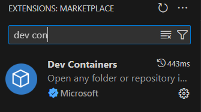
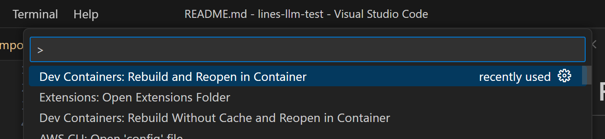
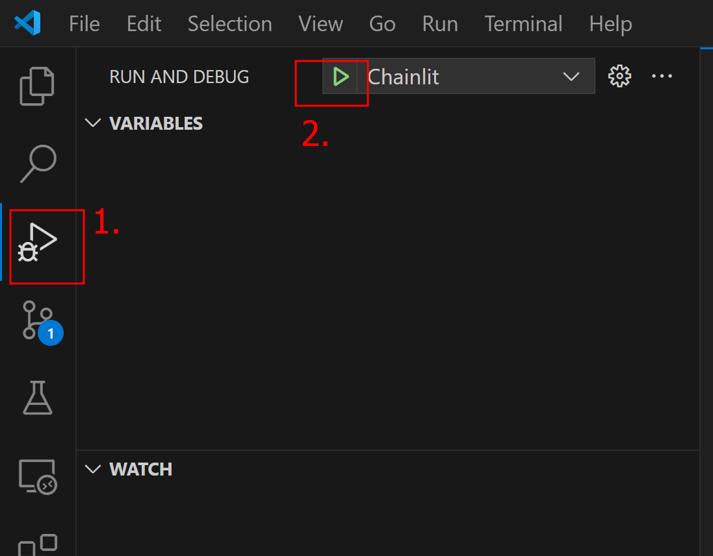
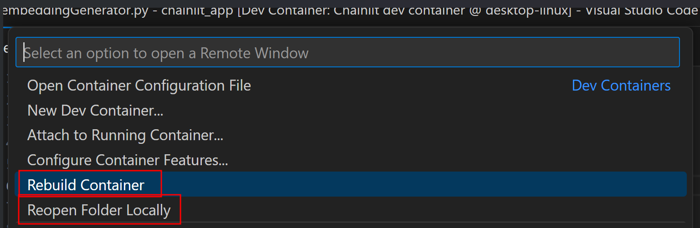
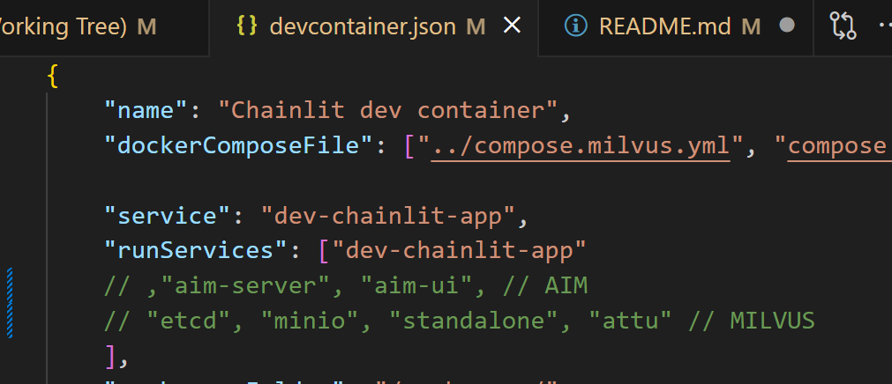

# Proyecto RAG
### Cómo ejecutar en un dev container

1. Instalar la extensión de Dev Containers.

    

2. Para entrar al Dev Container, utiliza el atajo `Ctrl + Shift + P` y busca "Dev Containers: Rebuild and Reopen in Container".

    

3. Dentro del contenedor, utiliza el depurador de Python para ejecutar la aplicación de Chainlit.

    

4. Si realizas cambios en el archivo `docker-compose`, al entrar nuevamente al Dev Container, haz clic en el botón azul y selecciona "Reconstruir contenedor". Para salir del Dev Container, reabre la carpeta local.

    

5. Para seleccionar qué contenedores se inician al usar el Dev Container, edita el archivo `devcontainer.json` y descomenta los contenedores necesarios.

    

6. Las variables de entorno del Dev Container se pueden modificar en `.devcontainer/compose.extend.yml`.
